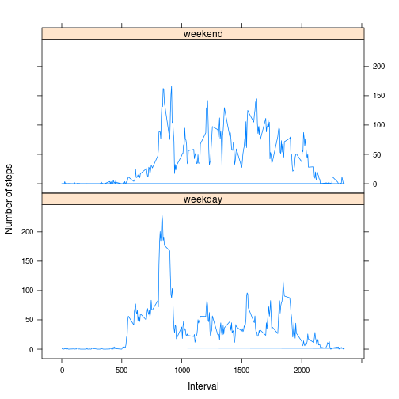

# Reproducible Research: Peer Assessment 1

## Loading and preprocessing the data

We have the data already present, but in zipped form,
so it will have to be unzipped first.
Let's do that in a directory "tmp".


```r
filezip <- "activity.zip"
filecsv <- "activity.csv"
tmpdir <- "tmp"
if (!file.exists(filecsv)) unzip(filezip, exdir = tmpdir, file = filecsv)
filecsv <- paste(tmpdir, filecsv, sep = "/")
```

The data is now in file tmp/activity.csv, so let's get it into a data table (for easier processing by group). Curiously the colClasses argument does not seem to do anything?


```r
if (!("data.table" %in% rownames(installed.packages()))) install.packages("data.table")
library(data.table)
data <- fread(filecsv, colClasses = c("integer", "Date", "integer"), na.strings="NA")
data$date <- as.Date(data$date)
```

## What is mean total number of steps taken per day?

As a first approximation, we'll just ignore it when values are not available, effectively taking them to be 0.


```r
total_per_day <- tapply(data$steps, data$date, sum, na.rm = TRUE)
median_total_per_day <- median(total_per_day)
mean_total_per_day <- mean(total_per_day)
hist(total_per_day)
abline(v = median_total_per_day)
abline(v = mean_total_per_day, col = "blue")
```

 

The median (black) and the mean (blue) are 10395 and 9354.2295.

## What is the average daily activity pattern?

Here the na.rm values are ignored, but in the context of average
that means that they are assumed to have that same average value.


```r
average_daily_activity <- data[, mean(steps, na.rm = TRUE), by=interval]
max_average_daily_activity <- max(average_daily_activity$V1)
where_max_average_daily_activity <- data[which.max(average_daily_activity$V1)]$interval
plot(average_daily_activity, type="l")
abline(h =       max_average_daily_activity)
abline(v = where_max_average_daily_activity)
```

 

The maximum average daily activity is 206.1698 at 835. It seems unfortunate that min() does not provide both values at once...

## Imputing missing values


```r
num_total <- nrow(data)
num_complete <- sum(complete.cases(data))
num_incomplete <- num_total - num_complete
```

Unfortunately there are those missing values: 2304 out of 17568.

It's easy enough to add a column where the missing values are replaced by the average
for that interval and redo the histogram calculations based on that:


```r
data[, imputed := ifelse(is.na(steps), mean(steps, na.rm = TRUE), steps), by=interval]
```


```r
total_imputed_per_day <- tapply(data$imputed, data$date, sum)
median_total_imputed_per_day <- median(total_imputed_per_day)
mean_total_imputed_per_day <- mean(total_imputed_per_day)
hist(total_imputed_per_day)
abline(v = median_total_imputed_per_day)
abline(v = mean_total_imputed_per_day, col = "blue")
```

 

Compare the medians: 10395 and 1.0766 &times; 10<sup>4</sup>.

Compare the means: 9354.2295 and 1.0766 &times; 10<sup>4</sup>. Shouldn't they be the same?

I don't immediately know what to make of that.

## Are there differences in activity patterns between weekdays and weekends?

As a first solution let's compute some needed values in new columns, although that does not seem very elegant.


```r
data[, sort_of_day := ifelse((weekdays(date) %in% c("Saturday", "Sunday")), "weekend", "weekday")]
data[, mean_imputed_per_interval_and_sort_of_day := mean(imputed), by="interval,sort_of_day"]
```


```r
library(lattice)

xyplot(data$mean_imputed_per_interval_and_sort_of_day ~ data$interval | data$sort_of_day,
       type = "l", layout = c(1, 2), xlab = "Interval", ylab = "Number of steps")
```

 
